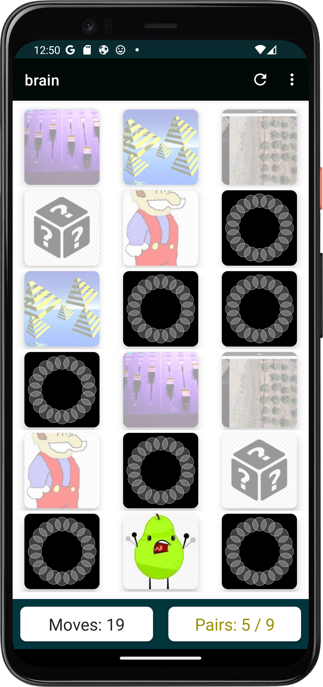

# Your Memory Game  -Yo Memory game app

This is a simple picture matching game to improve concentration

- You can play the game using default icons of different board size such as: 8x5, 7x4, 6x3 and 4x2
- You can customise the app by your own pictures as well
- It has also a feature to download others game and play in your device

## Technology Stack
- Kotlin to develop the game 
- Firebase storage to store images 
- Firebase  cloud firestore to store games with images
- Confetti library for animation
- Picasso for downloading pictures from firebase 
- Bitmap scaler to scale the images

## Android  UI Screen shoots 

